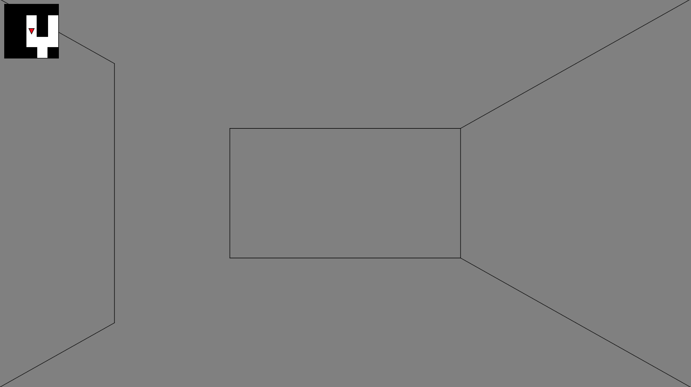

# Horror Processing

## About

Maze game which I developed when I was a freshman in university.  
The concept is to create a sense of three-dimensionality akin to a 3D game using only 2D lines. (inspired by 3-Demon)

大学 1 年生のときに作成した、迷路ゲーム  
2 次元の線のみから、3D ゲームのような立体感を表現することがコンセプト (inspired by 3-Demon)  
元々プレイヤー以外に敵キャラを用意するつもりでしたが、時間がなくこのような迷路ゲームになりました。タイトルにhorrorとあるのはその名残です。

## Tech Stack
Original: Processing  
Web: p5.js (converted from [processing-p5-convert](https://dkessner.github.io/processing-p5-convert/))

## How to Play
### Playing in Web (Recommended)

[https://shunshunNi.github.io/horror_processing](https://shunshunNi.github.io/horror_processing)

You start from at the very top left in the maze. The goal is at the very bottom right in the maze. Enjoy! 

### Plaing with Processing

Download "game" folder.  
Open the directory with Processing and press Play button in "game.pde" file.
